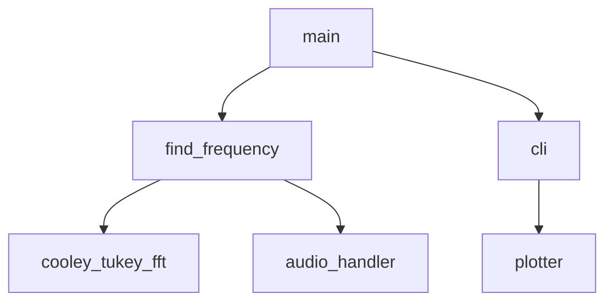

Ohjelman yleisrakenne

Saavutetut aika- ja tilavaativuudet (esim. O-analyysit pseudokoodista)
O(n log n)

Suorituskyky- ja O-analyysivertailu (mikäli sopii työn aiheeseen)
Toteuta: testaa suorituskykyä siten, että seuraa suurinpirtein O(n log n) kun syöte kasvaa

Työn mahdolliset puutteet ja parannusehdotukset

Käyttöliittymä hyvin karkea (periaattessa ei ollenkaan), ohjelma täytyy suorittaa uudelleen jokaisen tiedoston jälkeen. Näppärämpi käyttöliittymä jollain file explorerilla olisi mukava. 

Laajojen kielimallien (ChatGPT yms.) käyttö. Mainitse mitä mallia on käytetty ja miten. Mainitse myös mikäli et ole käyttänyt. Tämä on tärkeää!
Projektin alussa ChatGPT:tä ymmärtämään algoritmin syötteitä ja myös soundfile kirjaston read tulostusta (voiko vain heittää sen algoritmiin suoraan). Testauksessa expected joukkojen tulojen nopea laskeminen alkujoukoista.

Lähteet, joita olet käyttänyt, vain ne joilla oli merkitystä työn kannalta.
 
[Fast Fourier-transform (Wikipedia)](https://en.wikipedia.org/wiki/Fast_Fourier_transform)
 
[Cooley-Tukey (Wikipedia)](https://en.wikipedia.org/wiki/Cooley%E2%80%93Tukey_FFT_algorithm)
 
[Testisyötteiden kannalta hyödyllinen dst.stackexchange kommentti](https://dsp.stackexchange.com/a/634)
